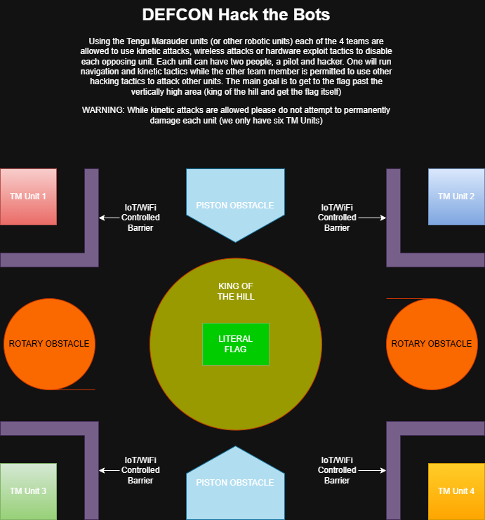

# 🧨 DEFCON Hack the Bots

**Location:** Hardware Hacking Village  
**Type:** Competitive Robotics & Wireless CTF  
**Hosted by:** Ex Machina Parlor  

---

## 📜 Event Premise

Four teams. One hill. Total mayhem.

Using **Tengu Marauder** units (or your own approved robotic unit), teams must combine **kinetic tactics**, **wireless interference**, and **hardware exploit attacks** to take control of the arena and seize the **literal flag** at the top of the hill.

### 👥 Team Composition

- **1 Pilot** – Drives the robot and executes kinetic tactics (ramming, blocking, etc.)
- **1 Hacker** – Launches wireless, IoT, or hardware exploit attacks on other teams.

---

## 🗺️ Arena Layout

  

### Obstacles and Features:
- **Rotary Obstacles** – Spinning blockers that require timing to bypass.
- **Piston Obstacles** – Push bots back or block access paths.
- **IoT/WiFi-Controlled Barriers** – Can be hacked by the hacker to open/close access lanes.
- **King of the Hill Zone** – Elevated platform in the center.
- **Literal Flag** – Capture and hold to win.

---

## 🎯 Game Objective

- Reach the central **King of the Hill** zone.
- Capture the **Literal Flag**.
- Defend the position using your movement and hacking abilities.
- The last bot holding the flag wins!

---

## 🧠 Allowed Tactics

| Tactic Type        | Description                                           |
|--------------------|-------------------------------------------------------|
| 🛞 Kinetic          | Ramming, blocking, shoving                            |
| 📡 Wireless         | Jamming, deauthing, signal interference               |
| 🔧 Hardware Exploits| Sensor spoofing, GPIO attacks, I2C disruption         |

---

## ⚠️ Rules & Safety

- No **permanent damage** to robots!  
  We only have **6 Tengu Marauder units** total.
- **Prohibited tactics**:  
  - Fire  
  - Liquids  
  - EMPs or high-voltage tools  
  - Cutting or melting tools  
- Wireless attacks must comply with DEFCON RF Village safety guidelines.

---

## 🛠️ Want to Participate?

- Sign up in person at the Hardware Hacking Village
- Or message **@ExMachinaParlor** on Discord
- Email: [info@exmachinaparlor.net](mailto:info@exmachinaparlor.net)

---

## 🏁 Summary

Robotics. Wireless Warfare. Pure fun.  
Can your bot survive the battlefield and seize the crown?

See you at the hill.

---

